# LaneAssist_OpenCV
This repository contains the school project due for the _Computer Vision_ class at Politecnico di Torino, Master of Science in Computer Engineering.

The project required the development of a OpenCV-Java application for detecting lane departure in provided videos.  
The graphical user interface has been developed with JavaFX and has been intended for allowing the tuning of the lane detection algorithm in order to have it work on any video.
In fact, the way the algorithm operates depends on many parameters, such as the video resolution, the dashcam's angle of view, the environment light, etc.

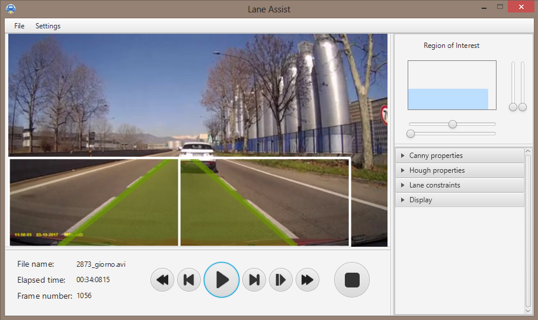

## User Interface
The rightmost part of the interface shows all the tunable parameters, divided by category.

The most important one is the Region of Interest (ROI) on which the algorithm is going to work. The topmost part of the panel represents the size and position of the region of interest as a blue rectangle inside an outlined box. While the box adapts automatically its width and height to the aspect ratio of the loaded video, the region of interest can be moved and resized with the four sliders surrounding the rectangles.  
Due to the lack of space in the panel, the action linked to each slider is not written but is directly shown on the box when the mouse is moved over the slider, as shown in the pictures below.  

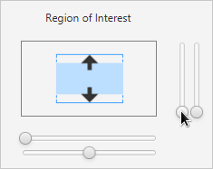 | 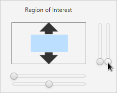 | 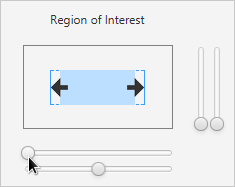 | 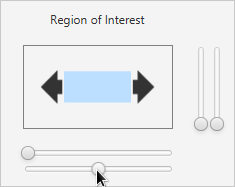  
:------------------------------------: | :-------------------------------------: | :-------------------------------------: | :------------------------------------:
Increase/decrease ROI height           | Move ROI up/down                        | Increase/decrease ROI width             | Move ROI left/right

The other categories contain all the parameters that toggle the visibility of the edges and lines that are seen as candidates for lane detection and help the tuning of the different steps of the algorithm, so that the latter can be adapted to different types of video.

## Algorithm
The algorithm for the lane detection works only on the selected region of interest, which must be carefully positioned and resized.
The lanes are detected through the following steps:  
#### Edge detection ####
Each frame is converted to grayscale and blurred to remove a tunable amount of details, then the Canny method is applied to the image for obtaining a binary one (i.e. black and white) where all the edges are highlighted in white.

#### Line detection ####
The lines are obtained from the edges through the _probabilistic Hough transform_ (`HoughLinesP`), which is more time-efficient than the simple Hough transform, and whose optimal parameters have been empirically identified.

#### Line choice ####

The _probabilistic Hough transform_ returns an array of lines, each defined by the start and end coordinates, which has to be read and pruned for selecting the useful lines.  
The lines are indeed selected based on a list of parameters:
* _Minimum_ and _maximum slope_. Horizontal and almost-horizontal lines are discarded, as there is a very little chance that they represent a lane. The slope is set by default between 10 and 90 degrees.
* _number of candidates_. The lower end of each line is compared to the center of the region of interest and inserted on the proper array of lines, depending on whether the line starts in the leftmost part of the ROI or on the rightmost one. The arraylist is ordered starting from the lines whose lower ends are the nearest to the center of the ROI.  
The _number of candidates_ value refers to the dimension of such arrays, which are pruned accordingly.
* _alpha_ is the angle created by a pair of lines. The lines of both arrays are in fact combined in order to create <left_line, right_line> pairs, which are then pruned based on the value of their alpha angle. Such an angle should be included in the range set by the _min alpha_ and _max alpha_ sliders.
* _horizon radius_. The lines' vanishing point's distance from the center of the region of interest. The line pairs are mainained as candidates if their vanishing point's coordinate is within a specific radius from the highest-end of the ROI's center.  
This prevents arrows or letters such as 'A' painted on the asphalt from misleading the lane detection algorithm and avoids an annoying flickering of the highlighted lane.

#### Lane Drawing ####
The lane is drawn on the video if and only if it remains stable for a certain number of frames (slider _frames before showing lane_). If there is no line pair satisfying all the constraints described before, the last valid lane from previous frames is drawn. If there was no detected lane in the previous frames, nothing is drawn on the current one, as the algorithm assumes that the road has no signage.

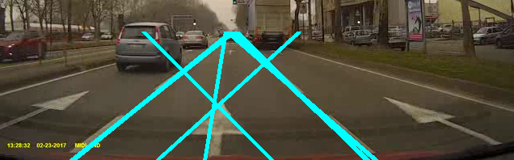 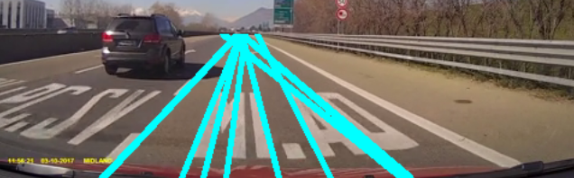

#### Lane Crossing ####
Once the lane has been detected, it is highlighted with a color that changes from green to red based on the distance of each line of the pair from the central line of the ROI.

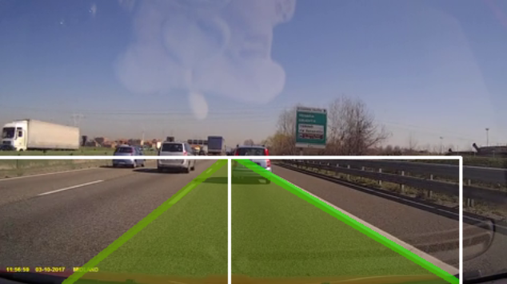 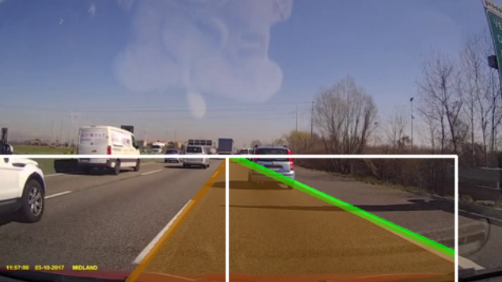 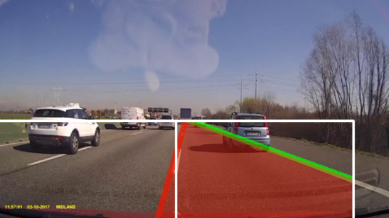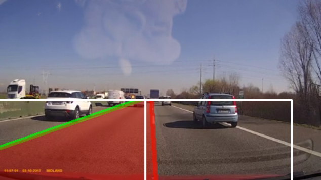
